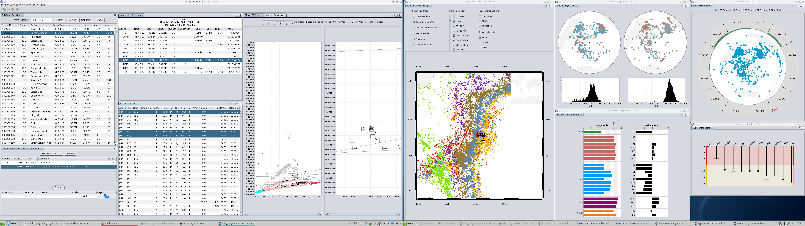

## VBAS : Visual Bulletin Analytics System

An example screenshoot of [2011 Tōhoku earthquake and tsunami](https://en.wikipedia.org/wiki/2011_T%C5%8Dhoku_earthquake_and_tsunami)

The GUI is designed to view on two-monitor screen. Please download and zoom to see the name the graphs and to get a more clear view of the graphs.  A brief description of some of the key graphs: 

**Phase Travel-time:** The grey curves are travel time curves for AK135 velocity model.  The various shapes represent the reported phase times.  The pale turquoise shapes are crustal phases, the pink shapes are mantle phases, the red shapes are core phases, the dark blue shapes are depth phases, the grey and black shapes are amplitude times and unknown phase types. 

**Hypocentre Seismicity:**  The coloured circles represent historical events from the ISC Bulletin from 1993-2013. The colours represent the prime hypocentre depths of the individual events and they are not scaled to magnitude. The large open diamond is the ISC prime (or preferred) hypocentre for this event and the large open squares indicate all the reported hypocentres from different institutes.

**Station Geometry:** This 360-degree projection is centred on the ISC prime (or preferred) hypocentre for the event (indicated by the black x). The blue circles are the stations that reported phases and/or amplitudes for this event. The pink arc on the outside of the grey circle shows the primary azimuthal gap and the orange arc next to the pink arc indicates the secondary azimuthal gap. The green curved histograms on the inside of the grey circle indicate the number of reported stations in that direction in 30 degree bins. The numbers in the grey dashed arcs show the proportion of stations and the number of stations reported in that 30-degree arc.

**Hypocentre Depths:** Reported hypocentre depths (in km) are shown by the vertical bars.  A fixed depth is indicated with a small open circle and reported depth errors are indicated by the short horizontal lines. The 3-5 letter codes represent the different institutes who calculated a hypocentre which was reported to the ISC. The ISC is highlighted in red and is the preferred depth.

## Background 

https://www.oerc.ox.ac.uk/projects/seismic-change
